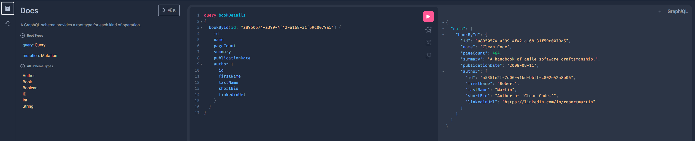

= Spring GraphQL - demo
:toc:
:toc-placement:
:toclevels: 3
:icons: font
:note-caption: :information_source:

== Introduction

In this demo we'll take a look at how we can use Spring GraphQL in our Java applications.
GraphQL is a query language (hence the QL) that in conjunction with a framework such as `Spring GraphQL` can be used to efficiently manage our data, and even reuse existing services.

It has 2 core concepts:

. queries: used for to define which data should be fetched, and which fields thereof should be included
. mutations: used to manage our dataset

It's an alternative to REST, SOAP, or gRPC, and supports calls over HTTP, WebSocket and RSocket.
We can use it to query & mutate our data, and in case of Spring Webflux/WebSocket/RSocket to set up subscriptions.

[NOTE]
====
Spring GraphQL is the successor of https://github.com/graphql-java/graphql-java-spring[GraphQL Java Spring]
====

Feel free to check out the code from this repository to more easily follow along.

== Setup

=== Dependencies

To get started we just need the following dependencies in our pom.xml:

[code,xml]
----
<dependencies>
    <dependency>
        <groupId>org.springframework.boot</groupId>
        <artifactId>spring-boot-starter-graphql</artifactId>
    </dependency>
    <dependency>
        <groupId>org.springframework.boot</groupId>
        <artifactId>spring-boot-starter-websocket</artifactId>
    </dependency>
    <dependency>
        <groupId>org.springframework.boot</groupId>
        <artifactId>spring-boot-starter-test</artifactId>
        <scope>test</scope>
    </dependency>
    <dependency>
        <groupId>org.springframework.graphql</groupId>
        <artifactId>spring-graphql-test</artifactId>
        <scope>test</scope>
    </dependency>
</dependencies>
----

[NOTE]
====
We're using Spring MVC here, but we could also use web/webflux/rsocket here (see for reference: https://docs.spring.io/spring-boot/docs/current/reference/html/web.html#web.graphql[possible starters])
====

=== Schema resources

We'll create a folder `src/main/resources/graphql/` where we'll put our `.graphqls` or `.gqls` file(s).
Spring Boot will automatically pick up the files placed here.
These files define our graph's data types, the relationships between them and possible operations.

Our basic schema will look like this:

[code,graphql]
----
type Query {
    bookById(id: ID): Book
}

type Book {
    id: ID
    name: String!
    pageCount: Int
    summary: String
    publicationDate: String
    author: Author!
}

type Author {
  id: ID
  firstName: String!
  lastName: String!
  shortBio: String!
  linkedinUrl: String!
}
----

We define a top-level `Query` type (every GraphQL service has to have one, mutations are optional), which contains the exposed operations and its arguments. Here we can see we're exposing a `bookById` query which expects an `ID` to be passed in, and will return a `Book` type.

Below that we can see our `Book` and `Author` type with their fields. In this case we're using the default scalar types, and the `!` mark the fields as non-null.

More information on how to define a `Schema` can be found on the https://graphql.org/learn/schema/[GraphQL schema] page.

[NOTE]
====
* We can change the supported file type(s) by changing: `spring.graphql.schema.file-extensions`
* The default schema location can be adapted using `spring.graphql.schema.locations`, we can even include files in our dependencies by using the `classpath*:` prefix
* field introspection is enabled by default, since tools like GraphiQL require it. If you do not want to expose your schema, set `spring.graphql.schema.introspection.enabled` to `false`
====

=== Properties

We'll also be enabling the graphical interactive GraphQL IDE (https://github.com/graphql/graphiql[GraphiQL]), by adding:
[code]
----
spring.graphql.graphiql.enabled=true
----

to our `application.properties`.

This allows us to easily interact with & develop GraphQL APIs.

Using the default http://localhost:8080/graphiql[graphiql] path.

[NOTE]
====
This can be adapted by configuring `spring.graphql.path`
====

== Controller configuration

Spring for GraphCL allows us to define handler methods using annotations in `@Controller` components.
The handler methods are registered as `DataFetcher` s through `RuntimeWiring.builder`.
Since we're using the Spring boot starter, we don't need to do anything special, but if you're not you'll need to add this `RuntimeWiringConfiguration` to `GraphQLSource.Builder`. (https://docs.spring.io/spring-boot/docs/3.1.1/reference/html/web.html#web.graphql.runtimewiring[see for reference])

We can use `@SchemaMapping` to define our handler methods & specify the type name, and field name. or leave it out in which case it'll use the simple class name of the source object & the method nome.

However, we can also use the meta annotations to make our life a bit easier, since these preset the typeName for us.

These are:

* `@QueryMapping`
* `@MutationMapping`
* `SubscriptionMapping`

=== Querying data

For our earlier book query we can add:

[code,java]
----
@QueryMapping
public Book bookById(@Argument String id) {
    return Book.getById(id);
}
----

Which makes use of the implicit mapping.

Now in case of our `Book`, we'll also need to do a little bit extra. Because our `Book` itself only contains the `authorId`, but in the response we want to return the `Author` immediately, to avoid our client having to do an extra round trip, and to aggregate the data.

We can resolve this by adding this to our controller:

[code,java]
----
@SchemaMapping
public Author author(Book book) {
    return Author.getById(book.authorId());
}
----
Which will act as the `DataFetcher` for the `Author` field.

If we add the following to our schema file:

[code,graphql]
----
authorById(id: ID): Author
----

We can set up an explicit mapping using the following, in case we don't want to call our function `authorById`

[code,java]
----
@QueryMapping("authorById")
public Author findAuthor(@Argument String id) {
    return Author.getById(id);
}
----

Note that here we've explicitly added `authorById` to our `@QueryMapping`

== (Dis)advantages

GraphQL has its advantages, and disadvantages over REST, and one can even use both in the sample application.

Advantages:

* flexible: the client can specify the required fields
* higher decoupling from API changes
* less expensive operations (reduced payload size, and data can be aggregated so less round trips)
* high discoverability given the APIs are introspectable, so clients can query the schema to find the available types & fields
* real-time data using subscriptions, without the need for polling

Disadvantages:

* no native file upload support
* no native support for web caching
* harder to cache given its flexible nature
* the flexible nature can also lead to complexity in managing the schema, and efficient query resolution

In case of data flexibility is needed/over-under-fetching is an issue/real time data is needed/mobile use-cases GraphQL is a good fit.
However, if the data structure is stable, caching is critical, resource-based models or simple CRUD calls there's certainly nothing wrong with rest.

At the end of the day you need to evaluate which fits your use-cases the best, and maybe even use a mix of both.

== Extra

Whilst the GraphQL protocol is focused on textual data, there is the informal https://github.com/jaydenseric/graphql-multipart-request-spec[graphql-multipart-request-spec] which allows file upload over HTTP. Keep in mind that this does lead to certain issues as documented on the https://www.apollographql.com/blog/backend/file-uploads/file-upload-best-practices/[Appolo GraphQL blog]. If you would like to use the spec in your application you can do so using: https://github.com/nkonev/multipart-spring-graphql[multipart-spring-graphql]

== References

* https://spring.io/projects/spring-graphql[Spring for GraphQL project]
* https://github.com/SimonVerhoeven/spring-graphql-demo[Demo repository]